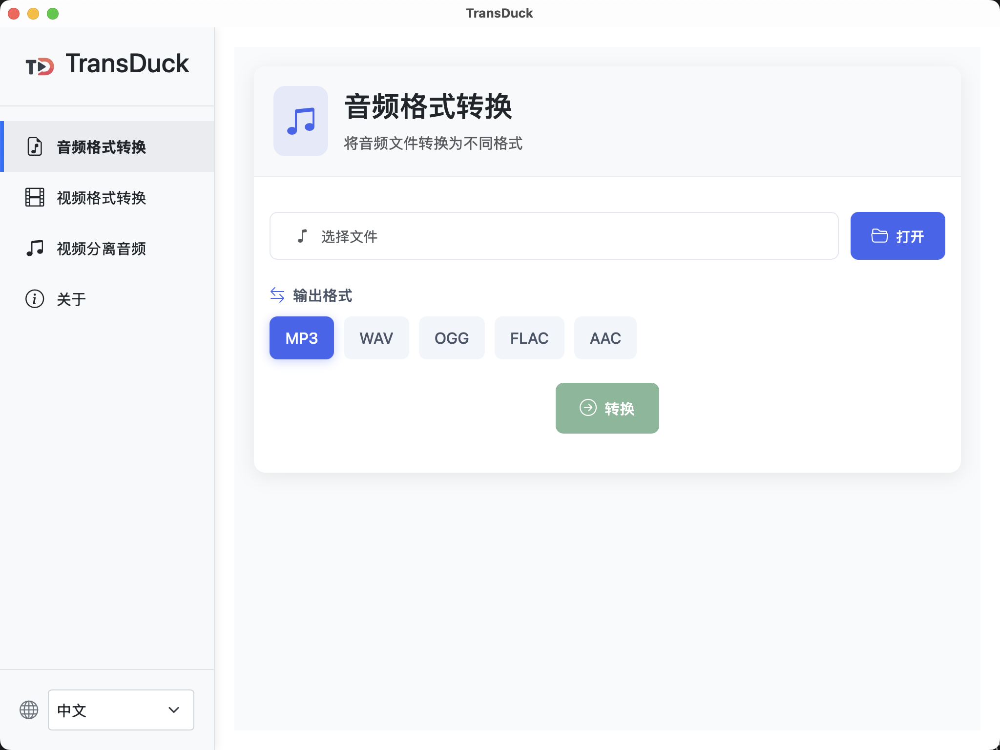

# TransDuck

<div align=center>
    
</div>

TransDuck是一个基于Tauri和Vue实现的免费跨平台桌面应用，提供各种音频/视频的处理能力。

- 官方网站：https://transduck.cc/
- 开源地址：https://github.com/dyc87112/transduck-desktop

> 目前SaaS版本的功能还未全部整合入客户端版本，后续会逐步加入到客户端，尽请期待 ^_^

## 技术栈

- **前端**: Vue 3
- **后端**: Node.js 22.15.0
- **框架**: Tauri 2.0
- **核心依赖**: ffmpeg 

## 核心功能

- 音频格式转换
- 视频格式转换
- 视频提取音频
- 国际化(中文、英文)
- ...

## 安装与运行

1. 安装核心依赖：`ffmpeg`

**MacOS安装命令**

```bash
# 1. 使用brew安装ffmpeg
brew install ffmpeg

# 2. 验证安装
ffmpeg -version
```

**Windows安装命令**

```bash
# 1. 安装Chocolatey（https://chocolatey.org/install）
Set-ExecutionPolicy Bypass -Scope Process -Force; [System.Net.ServicePointManager]::SecurityProtocol = [System.Net.ServicePointManager]::SecurityProtocol -bor 3072; iex ((New-Object System.Net.WebClient).DownloadString('https://community.chocolatey.org/install.ps1'))

# 2. 使用Chocolatey安装ffmpeg
choco install ffmpeg

# 3. 验证安装
ffmpeg -version
```

2. 验证`ffmpeg`的安装

```bash
# 打开终端运行，有显示版本信息即可
ffmpeg -version
```

3. 根据系统环境，下载安装包进行安装

- [TransDuck_0.1.0_arm64-setup.exe](https://s.transduck.com/transduck/desktop/TransDuck_0.1.0_arm64-setup.exe)
- [TransDuck_0.1.0_x64-setup.exe](https://s.transduck.com/transduck/desktop/TransDuck_0.1.0_x64-setup.exe)

4. 安装完成后，运行使用



## 开发与构建

如果想在本地自己构建，可以按如下步骤实现：

1. 安装依赖:

```bash
cd transduck-desktop
npm install
```

2. 运行开发服务器:

```bash
npm run tauri dev
```

### 生产构建

```bash
npm run tauri build
```

## 后续计划

1. 优化ffmpeg的安装，减少用户自己配置的步骤
2. 更多功能，包括 transduck.com 中的其他在线能力